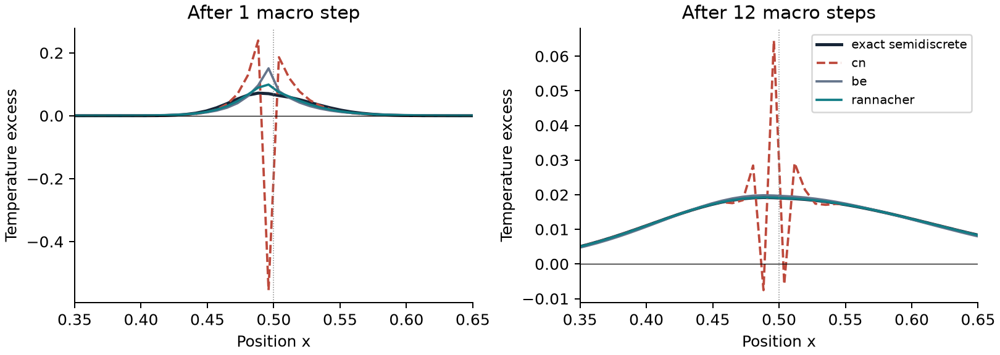

# HeatStart

**Stable heat flow can still ring.** A conservative finite-volume solver and
reproducible study of Crank–Nicolson (CN), backward Euler (BE), and Rannacher
startup for insulated, heterogeneous heat diffusion.



The synthetic pulse test gives a first-step CN minimum of **−0.554428** despite
reducing its quadratic energy to **0.505335** of its initial value. Four BE
half-steps followed by CN remove the undershoot in this experiment and lower
the final time error from **4.74669e-3** to **1.23099e-5**. This is an observed
result, not a guarantee of positivity for all later CN steps.

Read the original four-page [academic paper](paper/paper.pdf), its
[LaTeX source](paper/paper.tex), and [build instructions](paper/README.md).
All displayed numerical results come from [recorded metrics](examples/results/metrics.json).

## Install and reproduce

Python 3.11 or later; no C++ compiler required. From the repository root:

```sh
python -m venv .venv
# POSIX: source .venv/bin/activate
# PowerShell: .\.venv\Scripts\Activate.ps1
python -m pip install -e ".[dev]"
heatstart --output examples/results
python -m pytest -q
python -m ruff check .
python -m ruff format --check .
python scripts/check_samples.py
python paper/build.py --engine tectonic
python scripts/check_manifest.py
python -m build
```

The CLI also works as `python -m heatstart.cli --output my-results`. It writes
metrics, all pulse time histories, comparison profiles and three PNG figures.
An existing output directory's study files are replaced. Paths may contain spaces.
There are no random seeds, private inputs, or external numerical data to fetch.

## Governing equations and method

With unit cross-sectional area, insulated ends, constant-in-time positive
conductivity k and volumetric heat capacity c:

\[
c(x)\partial_t T=\partial_x(k(x)\partial_xT),\quad
kT_x|_{0,1}=0,\qquad M\dot{T}+KT=0.
\]

Each cell has M_i=c_i Δx_i. Adjacent cell conductance is
g_(i+1/2)=[Δx_i/(2k_i)+Δx_(i+1)/(2k_(i+1))]^-1. Each internal face
contributes equal and opposite heat rates, so 1ᵀMT is conserved. The symmetric
tridiagonal K has positive diagonal sums and off-diagonal entries −g.

The theta update is `(M + theta*dt*K) T_new = (M - (1-theta)*dt*K) T_old`.
BE uses theta=1, CN theta=1/2. Rannacher replaces the first two macro intervals
with two BE half-steps each, then uses CN. Factors are computed once per call
and reused through SciPy's compiled banded Cholesky solver: O(N) per factor
and step, O(N) factor storage. Returning every state requires O(N*steps) memory.
The spectral reference uses O(N²) storage and is intended for small verification
cases, not production-scale runs.

For theta≥1/2, the quadratic functional E=TᵀMT/2 cannot increase in exact
arithmetic. This is distinct from heat content. BE preserves nonnegative
temperatures at any step size. A sufficient CN positivity condition is
dt≤2 min_i(M_i/K_ii); above it, positivity is not guaranteed. Eigenmode
amplification `(1-z/2)/(1+z/2)` becomes negative when z=λdt>2 even though
its magnitude stays at most one. This explains alternating stiff modes.

## Python API

```python
import numpy as np
from heatstart import HeatGrid, evolve, exact_discrete

edges = np.linspace(0, 1, 65)
grid = HeatGrid(edges, np.ones(64), np.ones(64))
initial = 2 + np.cos(np.pi * grid.centres)
history = evolve(grid, initial, dt=0.001, steps=100, method="rannacher")
reference = exact_discrete(grid, initial, time=0.1)
print(grid.heat(history[-1]), grid.energy(history[-1]))
```

`HeatGrid` copies and marks its input arrays read-only. Inputs must be finite,
with strictly increasing edges and positive property arrays, one per cell.
`evolve` returns shape `(steps+1, cells)`; valid methods are `be`, `cn`, and
`rannacher`. `startup_steps` is a nonnegative integer, default 2; each call
restarts startup. Use a single call for an uninterrupted trajectory. With zero
startup intervals, `rannacher` equals CN. Properties use consistent units;
the supplied studies use dimensionless values. `explicit_bound` returns the
sufficient forward-Euler positivity bound for this mesh.

## Validation and outputs

- Dense solves, independent matrix exponentials, and analytical two-cell
  exchange verify the discrete algebra. Recorded exponential discrepancy:
  7.99e-15. Tests also cover heat/constant preservation, dissipation, invalid
  inputs, and positivity where guaranteed.
- At fixed mesh and final time 0.02, final refinement orders are 1.99997 (CN),
  0.99917 (BE), and 2.00003 (Rannacher). Coarse CN steps show strong ringing.
- A homogeneous cosine solution, initialized and compared as cell averages,
  isolates continuum spatial error through exact discrete time propagation.
  Error falls from 8.34572e-4 at 16 cells to 3.26430e-6 at 256 cells.
- Ubuntu and Windows CI run tests, lint/format, complete JSON/CSV reproduction,
  package builds and installed-wheel tests. The manuscript job compiles, checks
  the five-page limit and references, and renders every page.

See the [verification protocol](docs/validation.md) for precise setups, tolerances
and error definitions. To verify the wheel after building:

```sh
python -m pip uninstall -y heatstart
python -m pip install dist/heatstart-0.1.0-py3-none-any.whl
python -m pytest -q
python scripts/check_samples.py
```

## Scope and limitations

This is a one-dimensional, linear, source-free, perfect-contact model with
insulated boundaries. No radiation, convection, latent heat, moving interfaces,
contact resistance or temperature-dependent properties are represented. A
single-cell pulse is a mesh-defined stress test. The spectral reference verifies
the discretized ODE, not physical accuracy. The smooth homogeneous convergence
experiment does not prove convergence at material interfaces or on arbitrary
nonuniform meshes. Neither sampled positivity nor Rannacher startup proves a
universal maximum principle for later CN steps. No experimental calibration,
physical validation, or wall-clock speed claim is made.

## Provenance, references and license

Inspired by inspected DTU MMME course 41747 notes on heat diffusion, thermal
resistance and positivity. All code, experiments and figures are original;
no private course material is included. [Provenance](docs/provenance.md) records
the read-only course inspection and series rotation.

Established method references: R. Rannacher (1984), *Finite element solution
of diffusion problems with irregular data*, Numer. Math. 43, 309–327
([record](https://eudml.org/doc/132904)); H. P. Langtangen (2014),
[*Finite difference methods for diffusion processes*](https://hplgit.github.io/INF5620/doc/pub/H14/diffu/html/._main_diffu001.html).

[MIT license](LICENSE). No institutional affiliation or peer review is claimed.
